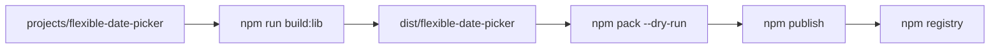

# Building and publishing ngx-flexible-date-picker

This guide is for **maintainers** who build and publish the Angular library to npm. End users should follow [projects/flexible-date-picker/README.md](../projects/flexible-date-picker/README.md) for installation and usage.

## Overview

| Item | Location |
|------|----------|
| Package name | `ngx-flexible-date-picker` |
| Source package manifest | [projects/flexible-date-picker/package.json](../projects/flexible-date-picker/package.json) |
| Library source | [projects/flexible-date-picker/](../projects/flexible-date-picker/) |
| ng-packagr config | [projects/flexible-date-picker/ng-package.json](../projects/flexible-date-picker/ng-package.json) |
| **Publishable output** | `dist/flexible-date-picker/` (after build) |
| Monorepo root | [package.json](../package.json) — marked `"private": true`; **do not publish from here** |



The workspace uses **ng-packagr** (`ng build flexible-date-picker`) to compile the library, generate FESM bundles and type definitions, copy assets, and write the final `package.json` into `dist/flexible-date-picker`.

---

## Prerequisites

1. **Node.js and npm** — use versions compatible with Angular 20 in this repo.
2. **Dependencies installed** at the monorepo root:

   ```bash
   npm install
   ```

3. **npm account** with permission to publish `ngx-flexible-date-picker` (or your chosen scoped name).
4. **npm two-factor authentication** — enable it in [npm account settings](https://www.npmjs.com/settings) if publish requires 2FA.

---

## One-time setup

### 1. Log in to npm

```bash
npm login
npm whoami
```

### 2. Check package name availability

```bash
npm view ngx-flexible-date-picker
```

A **404** means the name is not taken. If the name is already yours or you use a scope, skip this step.

### 3. Configure package metadata

Edit [projects/flexible-date-picker/package.json](../projects/flexible-date-picker/package.json) before the first public release. Recommended fields:

```json
{
  "name": "ngx-flexible-date-picker",
  "version": "0.0.1",
  "description": "Flexible date and time pickers for Angular 20+",
  "keywords": ["angular", "datepicker", "date-picker", "time-picker"],
  "license": "MIT",
  "author": "Your Name <you@example.com>",
  "repository": {
    "type": "git",
    "url": "https://github.com/your-org/flexible-date-picker.git"
  },
  "homepage": "https://github.com/your-org/flexible-date-picker#readme",
  "bugs": {
    "url": "https://github.com/your-org/flexible-date-picker/issues"
  },
  "peerDependencies": {
    "@angular/common": "^20.3.0",
    "@angular/core": "^20.3.0",
    "date-fns": "^4.0.0"
  }
}
```

**Why add `date-fns` as a peer dependency?** The library imports `date-fns` at runtime. Consumers must install it separately; listing it as a peer avoids duplicate copies and matches the consumer README.

Add a **LICENSE** file at the repo root if you publish under an open-source license.

### 4. Scoped packages (optional)

If the name is `@your-org/ngx-flexible-date-picker`, add to the library `package.json`:

```json
"publishConfig": {
  "access": "public"
}
```

On the **first** publish from `dist/flexible-date-picker`:

```bash
npm publish --access public
```

---

## Pre-release checklist (every version)

Complete this before every publish:

- [ ] **Tests pass:** `npm test`
- [ ] **Version bumped** in [projects/flexible-date-picker/package.json](../projects/flexible-date-picker/package.json) (semver below)
- [ ] **Consumer README** ([projects/flexible-date-picker/README.md](../projects/flexible-date-picker/README.md)) reflects the public API (recommended)
- [ ] **Library built:** `npm run build:lib`
- [ ] **Dist inspected:** files under `dist/flexible-date-picker/` look correct
- [ ] **Dry-run reviewed:** `cd dist/flexible-date-picker && npm pack --dry-run`
- [ ] **Built manifest checked:** `dist/flexible-date-picker/package.json` has correct `name`, `version`, `peerDependencies`, and `exports`

### Semantic versioning

| Change type | Version bump | Example |
|-------------|--------------|---------|
| Bug fix, no API break | Patch | `0.0.1` → `0.0.2` |
| New feature, backward compatible | Minor | `0.0.2` → `0.1.0` |
| Breaking API change | Major | `0.1.0` → `1.0.0` |

Always bump version in the **source** `projects/flexible-date-picker/package.json`, then rebuild. Do not hand-edit `dist/flexible-date-picker/package.json`; ng-packagr regenerates it on each build.

---

## Build the library

From the **monorepo root**:

```bash
npm run build:lib
```

This runs `ng build flexible-date-picker` with the production configuration (`tsconfig.lib.prod.json`).

### What the build produces

| Path in `dist/flexible-date-picker/` | Purpose |
|--------------------------------------|---------|
| `fesm2022/ngx-flexible-date-picker.mjs` | ESM bundle |
| `fesm2022/ngx-flexible-date-picker.mjs.map` | Source map |
| `index.d.ts` | TypeScript declarations |
| `README.md` | Copied from the library project (shown on npm) |
| `package.json` | Merged manifest (`module`, `typings`, `exports` added by ng-packagr) |
| `src/lib/themes/flexible-date-picker.css` | Main theme entry (imports base) |
| `src/lib/themes/flexible-date-picker-base.css` | CSS custom properties |

### Theme CSS import path (important)

The consumer README documents:

```css
@import 'ngx-flexible-date-picker/themes/flexible-date-picker.css';
```

With the **current** [ng-package.json](../projects/flexible-date-picker/ng-package.json) asset layout, published CSS lives at:

```css
@import 'ngx-flexible-date-picker/src/lib/themes/flexible-date-picker.css';
```

Until assets are remapped (for example, output to `themes/` in `ng-package.json`), document the **actual** path for consumers or fix packaging before the first public release.

**Recommended follow-up:** remap theme assets in `ng-package.json` so the published path matches the README, then rebuild and verify with `npm pack --dry-run`.

---

## Verify before publish

```bash
cd dist/flexible-date-picker
npm pack --dry-run
```

Review the file list and tarball size. Confirm:

- `package.json` — `name`, `version`, peers
- `fesm2022/` and `index.d.ts` present
- Theme CSS files included
- No accidental dev-only files

Optional: create a local tarball and inspect it:

```bash
npm pack
tar -tzf ngx-flexible-date-picker-*.tgz
rm ngx-flexible-date-picker-*.tgz
```

---

## Publish to npm

All publish commands run from **`dist/flexible-date-picker`**, not the repo root.

### First stable release (end-to-end)

From the monorepo root:

```bash
npm install
npm test
npm run build:lib
cd dist/flexible-date-picker
npm pack --dry-run
npm publish
```

### Subsequent releases

1. Bump `version` in `projects/flexible-date-picker/package.json`.
2. Run the same flow: `npm test` → `npm run build:lib` → `cd dist/flexible-date-picker` → `npm pack --dry-run` → `npm publish`.

### Prerelease (beta, alpha, etc.)

1. Set version in source, e.g. `0.1.0-beta.0`.
2. Build and publish with a dist-tag:

   ```bash
   npm run build:lib
   cd dist/flexible-date-picker
   npm publish --tag beta
   ```

3. Consumers install with:

   ```bash
   npm install ngx-flexible-date-picker@beta
   ```

### Scoped package — first publish

```bash
npm publish --access public
```

---

## Post-publish verification

1. **Registry metadata:**

   ```bash
   npm view ngx-flexible-date-picker
   npm view ngx-flexible-date-picker version
   ```

2. **Install in a clean app:**

   ```bash
   npm install ngx-flexible-date-picker date-fns
   ```

3. **Import** a picker component and the theme stylesheet using the **actual** published CSS path (see [Theme CSS import path](#theme-css-import-path-important) above).

4. **Dist-tags (optional):**

   ```bash
   npm dist-tag ls ngx-flexible-date-picker
   ```

---

## Troubleshooting

| Problem | Likely cause | Fix |
|---------|--------------|-----|
| `403 Forbidden` on publish | Not logged in, no access, or 2FA required | `npm login`, check org permissions and 2FA |
| `404` or wrong package on publish | Publishing from wrong directory | `cd dist/flexible-date-picker` |
| `You cannot publish over the previously published versions` | Version already on npm | Bump version in **source** `package.json`, rebuild |
| Empty or stale dist | Forgot to rebuild | `npm run build:lib` from repo root |
| Missing types or exports | Build or `public-api.ts` issue | Rebuild; check [projects/flexible-date-picker/src/public-api.ts](../projects/flexible-date-picker/src/public-api.ts) and prod tsconfig |
| Published monorepo root by mistake | Wrong folder | Root `package.json` is `"private": true`; only publish `dist/flexible-date-picker` |

---

## Recommended before first public release

These are not required to run the publish commands, but they improve the npm package quality:

1. Add npm metadata (`description`, `license`, `repository`, etc.) to [projects/flexible-date-picker/package.json](../projects/flexible-date-picker/package.json).
2. Add **`date-fns`** to `peerDependencies`.
3. Add a **LICENSE** file at the repo root.
4. **Align theme asset paths** in `ng-package.json` with the consumer README import path.
5. Enable **npm 2FA** for publish.

---

## Optional: CI/CD automation

You can publish from CI on a git tag (for example `v0.1.0`):

1. Check out the tag.
2. `npm ci`
3. `npm test`
4. `npm run build:lib`
5. `cd dist/flexible-date-picker && npm publish` using an `NPM_TOKEN` secret (write-only token with publish access).

Example pattern (GitHub Actions — adapt to your host):

```yaml
- run: npm ci
- run: npm test
- run: npm run build:lib
- run: npm publish
  working-directory: dist/flexible-date-picker
  env:
    NODE_AUTH_TOKEN: ${{ secrets.NPM_TOKEN }}
```

Ensure the CI job bumps version or only runs on version tags so you do not republish the same version.

---

## Quick reference

| Task | Command |
|------|---------|
| Install deps | `npm install` (repo root) |
| Run tests | `npm test` |
| Build library | `npm run build:lib` |
| Dry-run pack | `cd dist/flexible-date-picker && npm pack --dry-run` |
| Publish | `cd dist/flexible-date-picker && npm publish` |
| Prerelease publish | `npm publish --tag beta` |

**Source of truth for version:** [projects/flexible-date-picker/package.json](../projects/flexible-date-picker/package.json)

**Never publish from:** monorepo root (`private: true`)

**Always publish from:** `dist/flexible-date-picker/`
